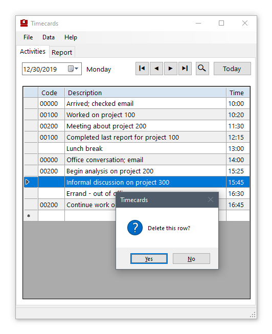
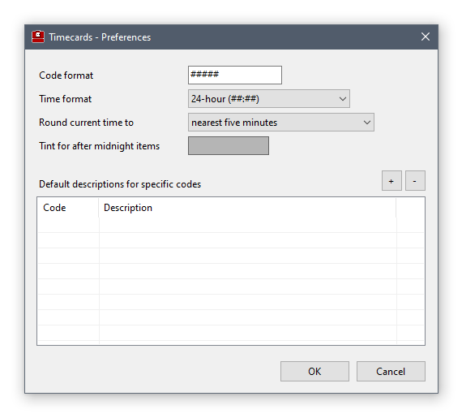
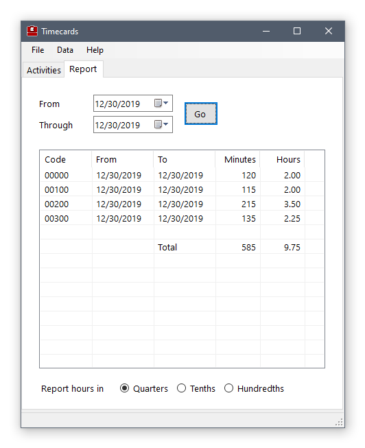
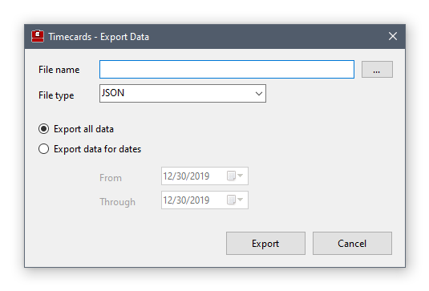

# Timecards

## Description

This is a Windows application for recording how much time you spend on various
projects.  At any time, you can report the total amount of time you've spent
on each project.

### Development Features of Interest

This application is an example of "clean architecture" in that it separates core
application functionality from persistence and user interface functionality.

This application uses SQLite - a lightweight, zero-footprint relational database
engine.  It uses Microsoft's Entity Framework and Code First to maintain the
database schema and provide quick, efficient access to the data.

See the "README" files for each component for an explanation of the features in
this application.

## Installation

I'm working on that.  Stay tuned.

### Requirements

This program requires the Microsoft .NET Framework, version 4.7.2, running on
Windows.  If you do not have this framework installed, it is available from
Microsoft:  
https://dotnet.microsoft.com/download/dotnet-framework/net472

## Usage

### **Main Form**

When you first launch Timecards, you're presented with a form that looks like
this:

The main form has two tabs:  one for entering the day's activities, and another
one for adding up the time spent on each project and displaying the totals.

At the top of the form is the date for the current timecard.  There is one
timecard per day.  You can navigate to other timecards using the next and
previous buttons, and you can find a specific date using the search button.

The "Today" button will locate the timecard for the current date, and it will
create it if the timecard doesn't exist.

### **Entering New Activities**

As the day progresses, you can enter the activity you're working on.  Enter a
code that corresponds to the project - this can be anything you want, but it's
controlled by a format string you supply in the Preferences form.  Following the
code, enter a description to indicate what you're doing.  After that, enter the
time you started this activity.  The time defaults to the current time, but you
can change it as needed.

Activities don't need a code.  You can enter an activity without a code to
indicate "off" time (like a lunch break) or simply to record time that isn't
associated with a project.

The last entry in any timecard indicates the stopping time for the last
activity.  Always enter this row without a code.

### **Editing Activities**

At any time, you can edit any activity - you can change the code, the
description, or the time of any item.

If you need to insert an activity for an earlier time in the day, just add it to
the end of the list.  You can then use the "Sort activities by time" function in
the Data menu, or you can simply navigate to another timecard and then back.

### **Deleting an Activity**

Deleting an activity is simple:  just highlight the entire row by clicking on
the indicator column at the left of the activity; then, press the Delete key on
the keyboard.

### **Working Past Midnight**

If you enter an activity for the current timecard, but you've started the
activity after midnight (so it's actually the next day), the row is given a
background tint to indicate this is the case:

You can change the color of this tint in the Preferences form.

When you sort the activities for this timecard, these "after midnight"
activities will appear in the proper order.

You can toggle the "after midnight" flag for the current activity with the
"Activity is after midnight" function in the Data menu, or by pressing ctrl-M.

### **Preferences Form**

When you select "Preferences" from the File menu, you are presented with this
form:

Here you can specify the format that controls what characters are allowed for
the Code column.  Use "#" for digits, "L" for letters, or "A" for alphanumeric
characters (either digit or letter).  Other format characters are possible - see
the [Microsoft MaskedTextBox Control page](https://docs.microsoft.com/en-us/dotnet/api/system.windows.forms.maskedtextbox.mask?view=netframework-4.8) for details.

The format for representing an activity's time can be either 12-hour or 24-hour
time, and you can use either a colon or decimal separator for the hour and
minute digits.

When you enter a new activity, the current time is automatically supplied.  You
can have that time rounded to the nearest five minutes, or choose one of the
other rounding options available.

When an activity starts after midnight (that is, the next day), it is "tinted"
with a different background color to distinguish it from the previous day's
activities.  You can specify what color to use for this tint.

A default description can be automatically supplied for certain codes.  Use the plus
(+) button to add a code and description to the defaults list.  Use the minus (-) button to remove an item from this list.

### **Reporting Time By Project**

When you select the Report tab in the main form, you'll see these controls:

Specify the beginning and ending dates of the range of timecards you want to
analyze.  The range defaults to the current day.

When you click the "Go" button, the elapsed time for each project is tallied and
displayed.  If you're reporting for than more than one day, the earliest and
latest days for each project is shown.

The total elapsed time for each project is shown both in minutes and hours.  For
the hours, you have a choice of rounding the hour amounts to the nearest quarter
hour, tenth of an hour, or hundredth of an hour.

### **Importing and Exporting Timecards**

If you want to import timecard data into the Timecards program from some other
source, you can use the "Import" function from the File menu.  It brings up this
form:

You can import data from text files that are in either comma-separated format,
tab-separated format, JSON format, or XML format.

You can generate example files by entering a few activities for a timecard and
then using the Export form to create a file.

If you check the "Erase existing data" checkbox, all existing timecards will be
deleted before the import is performed.  Otherwise, the imported data is added
to the existing timecards.

Use the "Export" function from the File menu to bring up the Export form:

The same four file formats are available for exporting data.  You can export the
entire database or select a specific range of timecard dates.

## Credits

Many thanks to the open-source contributors that created the components used by
this program:

* NewtonSoft JSON library by James Newton-King
* SQLite CodeFirst library by Marc Sallin
* SQLite database engine, EF, and LINQ interfaces by the SQLite Development Team
* Entity Framework and other .NET components by Microsoft

Also many thanks to Robert "Uncle Bob" Martin for his wonderful book "Clean
Architecture" [(ISBN-13:
978-0134494166)](https://www.amazon.com/Clean-Architecture-Craftsmans-Software-Structure/dp/0134494164)
that explains how to correctly design an application, and to [Jason
Taylor](https://www.youtube.com/watch?v=_lwCVE_XgqI) and [Tim
Corey](https://www.youtube.com/watch?v=2moh18sh5p4) for their helpful YouTube
videos.  Also thanks to Tim Ross and his article on [how an inversion-of-control
container
works](https://timross.wordpress.com/2010/01/21/creating-a-simple-ioc-container/).

## License

This program is released under the MIT license.  See the LICENSE document for
details and limitations.

